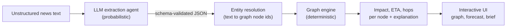

# ChokePoint AI — Supply Chain Shock Simulator

[](https://github.com/Yura0Bodnar/ChokePoint-AI/actions/workflows/ci.yml)


> Paste a breaking headline. An LLM agent turns the unstructured text into a strict, validated
> disruption event; a **deterministic graph engine** then shows which ports, commodities,
> industries and markets get hit next: **how hard, how many hops away, and how many days from now.**

## Elevator pitch

Supply-chain shocks first show up as messy prose: a strike at Hamburg, an attack near Suez, a
closed grain corridor. ChokePoint AI ingests that text and uses an **LLM extraction agent** to read
it into a schema-validated `DisruptionEvent` (type, locations, goods, severity, confidence). It
then overlays the event on a **44-node / 81-edge dependency graph** of ports, routes, commodities,
industries and markets, and a **deterministic propagation model** calculates the cascade.

The split is the point: **the LLM only reads, it never computes.** Every number on screen comes
from plain, unit-tested graph math (same event in, same forecast out), and every result carries the
path and explanation that produced it.

## Run it (judges, start here)

> ### All Docker and testing commands are in **[`RUN_INSTRUCTIONS.md`](RUN_INSTRUCTIONS.md)**
>
> One document covers everything: starting the app with Docker Compose, running the test suite,
> lint and type checks, endpoint smoke tests, and the optional Hugging Face / local-model setup.
> The default configuration runs fully offline with no API key.

## Architecture



| Layer | Responsibility | Nature |
|---|---|---|
| **LLM extraction** (`agent/`) | Text to a Pydantic-validated `DisruptionEvent`. Versioned prompt, fence-aware parser, JSON repair, retries with error feedback, heuristic fallback. | Probabilistic, fenced in by validation |
| **Graph engine** (`graph/`) | Weighted-BFS shock propagation over a sourced YAML graph (every edge has a `source_ref`). | Deterministic, fully unit-tested |
| **API** (`api/`) | FastAPI orchestrator: `text -> event -> simulation`. Depends only on two Protocols (`LLMProvider`, `GraphStore`). | Stateless |
| **UI** (`web/`) | Cytoscape.js impact graph, forecast table, intelligence brief, what-if severity slider. | No build step |

### What the graph computes

Starting from the epicentre nodes, impact spreads breadth-first along weighted edges:

```text
impact(target) = impact(source) x edge_weight x decay^hops x (1 - resilience) x substitution_factor
```

- **Hops**: graph distance from the epicentre (capped by `max_hops`, default 4).
- **ETA**: cumulative `lead_time_days` along the strongest path (days until the shock arrives).
- **Impact**: 0..1 score, damped by each node's resilience and by healthy substitute nodes (for
  example Rotterdam absorbing Hamburg traffic). Cycle-safe; contributions below 0.02 are pruned.

The what-if severity slider re-runs **only** the graph, so it is instant and never calls the LLM.
Every edge weight in the seed graph is sourced and documented in
[`SOURCES.md`](src/chokepoint/graph/seed/SOURCES.md).

### Reliability by design

- **Never trusts raw model output.** Prompt asks for a single ```` ```json ```` block, a regex
  extracts it, `json-repair` fixes near-misses, Pydantic enforces the contract, failures trigger a
  retry with the exact validation error, and a keyword heuristic is the last resort for unparseable output.
- **No silent slow paths.** If Hugging Face is down or out of credits, the API answers HTTP 424 and
  the UI asks before running the local CPU model (Qwen2.5-1.5B, about 40 s). Consent is per request.
- **Offline-capable.** A stub LLM provider and a `DEMO_MODE` graph cascade keep the demo alive
  without network access; results are flagged with a "degraded run" badge so nothing is misleading.

## Tech stack

| Area | Choice |
|---|---|
| Backend | Python 3.12, **FastAPI**, Pydantic v2, pydantic-settings |
| Graph | **NetworkX** (44 nodes, 81 edges across the Hamburg, Suez / Red Sea and Black Sea grain corridors) |
| LLM | Hugging Face Inference API (`openai/gpt-oss-20b`), local `transformers` CPU fallback, offline stub |
| Frontend | Static HTML + Tailwind + Cytoscape.js (no bundler) |
| Packaging / CI | **Docker** + Docker Compose, GitHub Actions (ruff, mypy, pytest, image build), HF Space deploy workflow |
| Quality | uv, ruff, mypy on the whole package, 290+ automated tests |

## API at a glance

`POST /api/v1/simulate` with `{"text": "Port Workers Strike in Hamburg halts container operations..."}`
returns the extracted event plus the ranked cascade (trimmed, produced by the offline stub provider):

| Impacted node | Impact | ETA | Hops | Path |
|---|---|---|---|---|
| North Sea maritime corridor | 0.21 | 1.0 d | 1 | Hamburg to North Sea |
| Industrial chemicals | 0.08 | 4.0 d | 1 | Hamburg to Industrial chemicals |
| Rhine inland freight route | 0.04 | 3.0 d | 2 | Hamburg to North Sea to Rhine |

Interactive API docs are served at `/docs`. Requests may also pass a ready-made `event` (skipping
the LLM) or `severity_override`, and `force_local: true` to consent to the local model.

## Repository layout

```text
src/chokepoint/
├── contracts.py     # frozen shared data contracts
├── config.py        # settings (env-driven)
├── api/             # FastAPI app, routers, DI seams, orchestrator
├── agent/           # LLM extraction: prompts, providers (HF / local / stub), parser, failover
├── graph/           # NetworkX engine, propagation math, seed graph (nodes, edges, SOURCES.md)
├── ingestion/       # GDELT fetch + normalisation + dedupe
└── web/             # static UI (index.html, app.js, style.css)
tests/               # unit, integration, eval (golden set); live/local tests are opt-in
```

## Known limitations

- News ingestion accepts pasted text today; the GDELT fetcher (`scripts/fetch_sample_news.py`)
  collects and stores raw articles but is not yet wired into a live feed.
- Lookup by `doc_id` is intentionally unimplemented — there is no document store yet.
- Free-tier Hugging Face inference credits are limited, which is why the local CPU fallback and
  the offline stub provider exist.

---

Maintained by [Yura0Bodnar](https://github.com/Yura0Bodnar).
